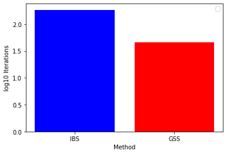
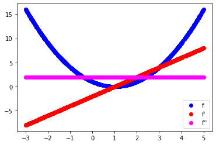
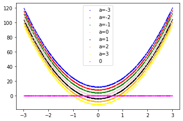
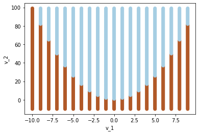
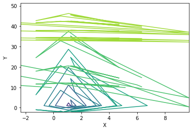
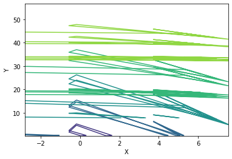

# Homework 5: Optimization


```python
import numpy as np
import pandas as pd
import matplotlib.pyplot as plt
import random
import math
from scipy.optimize import minimize
```

## Problem 1: Interval Bisection Search and Golden Section Search - 1-D Optimization

### Definition of function and its derivative


```python
# function of x**2
def x2(x):
    return x**2
```


```python
# Derivative of x**2
def x2der(x):
    return 2*x
```

### Definition of IBS and GSS method


```python
def IBS(derivative, u, l, tol=10**(-4), maxiter=50):
    iteration = 0
    # End condition
    while (u - l > tol) and (iteration < maxiter):
        value = derivative( ( u + l ) /2)
        if value < 0:
            l = value
        else:
            u = value
            
        iteration += 1
    
    return ((u + l) /2, iteration)
        
```


```python
def GSS(function, u, l, tol=10**(-4), maxiter=50):
    golden = (1 + 5 ** 0.5) / 2 -1
    iteration = 0
    # End condition
    while (u - l > tol) and (iteration < maxiter):
        x1 = u - golden*(u - l)
        x2 = l + golden*(u - l)
        value1 = function(x1)
        value2 = function(x2)
        
        if value1 < value2:
            u = x2
        else:
            l = x1
            
        iteration += 1
    
    return ((u + l) /2, iteration)    
```

### 50 IBS and GSS iterations


```python
ibs = []
gss = []
maxiterations = 1000
for i in range(50):
    lower = np.random.uniform(-10, 0)
    upper = np.random.uniform(0, 10)
    tolerance = np.random.uniform(10**(-8), 0)
    ibs.append(IBS(x2der, upper, lower, tolerance, maxiter=maxiterations)[1])
    gss.append(GSS(x2, upper, lower, tolerance, maxiter=maxiterations)[1])

```

### IBS and GSS comparison


```python
plt.bar('IBS', height= np.log10(np.average(ibs)), color='blue')
plt.bar('GSS', height= np.log10(np.average(gss)), color='red')
plt.xlabel('Method')
plt.ylabel('log10 Iterations')
plt.legend()
```

    No handles with labels found to put in legend.
    


    <matplotlib.legend.Legend at 0x1e2915f6d00>


    

    


#### We can clearly see that GSS is in faster than IBS for the experiment conducted

## Problem 2: Convexity in 1- and 2-Dimensions

### 1. Using first and second derivatives confirm or reject that f is convex <!-- $f(v)=(1−v)^2$ --> 
#### <!-- $f' = -2(1-v)$ -->  we can see that <!-- $f'(1)=0$ -->  which corresponds to the minimum of f.
#### <!-- $f'' = 2$ -->  We can see that <!-- $f''$ -->  is always positive through its domain. This implies that f is convex.
#### Let's have a visual approach.


```python
def f(x):
    return (1-x)**2
```


```python
def f1(x):
    return -2*(1-x)
```


```python
def f2(x):
    return 2
```


```python
xs = []
fs = []
f1s = []
f2s = []

for i in range(1000):
    x = np.random.uniform(-3, 5)
    xs.append(x)
    fs.append(f(x))
    f1s.append(f1(x))
    f2s.append(f2(x))

plt.scatter(xs,fs, color='blue', label='f')
plt.scatter(xs, f1s, color='red', label="f'")
plt.scatter(xs, f2s, color='magenta', label="f''")
plt.legend()
```


    <matplotlib.legend.Legend at 0x1e291d561f0>


    

    


### 2. <!-- $g(v)$ -->  and <!-- $h(v)$ -->  are convex, is <!-- $f(v) = g(v) + h(v)$ -->  convex?
#### Since <!-- $g$ -->  and <!-- $h$ -->  are convex, we have that <!-- $g''$ -->  and <!-- $h''$ -->  are <!-- $> 0$ --> . This means that <!-- $f'' = g'' + h''$ -->  is also > 0 and therefore convex.

### 3. <!-- $g(v)=(a−v^2)^2$ -->  where <!-- $a$ -->  is a fixed real number.
#### <!-- $g' = -4v(a-v^2)$ --> 
#### <!-- $g'' = -4(a-3v^2)$ -->  
#### We want <!-- $g'' = 12v^2 - 4a  > 0  \to v^2 > \frac{a}{3}$ --> . This means that if  <!-- $a \le 0$ -->   <!-- $g$ -->  is convex in <!-- $\Re$ --> , else <!-- $g$ -->  is convex in the ranges <!-- $\brack -\infty,-\sqrt{\frac{a}{3}}$ -->  <!-- $\bigcup$ -->  <!-- $\brack \sqrt{\frac{a}{3}},\infty $ --> .


```python
def g2(x,a):
    return -4*(a-3*x**2)
```


```python
xs = []
g2s = []

for i in range(1000):
    x = np.random.uniform(-3, 3)
    xs.append(x)
    g2s.append([g2(x,-3),g2(x,-2),g2(x,-1),g2(x,0),g2(x,1),g2(x,2),g2(x,3)])

g2s = np.array(g2s)
zeros = np.zeros(len(g2s))
```


```python
plt.scatter(xs, g2s[:,0], s=0.5, color='blue', label='a=-3')
plt.scatter(xs, g2s[:,1], s=0.5, color='red', label='a=-2')
plt.scatter(xs, g2s[:,2], s=0.5, color='green', label='a=-1')
plt.scatter(xs, g2s[:,3], s=0.5, color='pink', label='a=0')
plt.scatter(xs, g2s[:,4], s=0.5, color='black', label='a=1')
plt.scatter(xs, g2s[:,5], s=0.5, color='orange', label='a=2')
plt.scatter(xs, g2s[:,6], s=0.5, color='yellow', label='a=3')
plt.scatter(xs, zeros, s=0.5, color='magenta', label='0')

plt.legend()
```


    <matplotlib.legend.Legend at 0x1e291e33bb0>


    

    


### 4. For a vector <!-- $v=[v1 v2]^T$ --> , let <!-- $p(v)=(1−v_1)^2+100∗(v_2−v_1^2)^2$ --> . Calculate the gradient and Hessian of <!-- $p$ --> , and confirm or reject that <!-- $p$ -->  is convex everywhere in <!-- $\Re^2$ --> 
<!-- $\nabla p = (2 (200 v_1^3 - 200 v_1 v_2 + v_1 - 1), 200 (y - x^2))$ -->  </br>

<!-- $H=\begin{bmatrix}(-400 (v_2 - v_1^2) + 800 v_1^2 + 2 & -400 v_1\\-400 v_1 & 200\end{bmatrix}$ -->   </br>

<!-- $\lambda_1 = 600 v_1^2 - \sqrt{360000 v_1^4 - 240000 v_1^2 v_2 + 41200 v_1^2 + 40000 v_2^2 + 39600 v_2 + 9801} - 200 v_2 + 101$ -->  </br>
<!-- $\lambda_2 = 600 v_1^2 + \sqrt{360000 v_1^4 - 240000 v_1^2 v_2 + 41200 v_1^2 + 40000 v_2^2 + 39600 v_2 + 9801} - 200 v_2 + 101$ -->  </br>

It is clear that <!-- $\lambda_1 \le \lambda_2 $ -->  therefore, we need to find the conditions that fulfill <!-- $\lambda_1>0$ --> 
<!-- $600 v_1^2 - \sqrt{360000 v_1^4 - 240000 v_1^2 v_2 + 41200 v_1^2 + 40000 v_2^2 + 39600 v_2 + 9801} - 200 v_2 + 101 > 0$ --> 

#### Finally, p is convex when <!-- $v_2 < \frac{1}{200} (200 v_1^2 + 1)$ --> 


```python
def eigen1(x,y):
    return 600*x**2 - math.sqrt(360000*x**4 - 240000*(x**2)*y + 41200*x**2 + 40000*y**2 + 39600*y + 9801) - 200*y + 101
```


```python
def eigen2(x,y):
    return 600*x**2 + math.sqrt(360000*x**4 - 240000*(x**2)*y + 41200*x**2 + 40000*y**2 + 39600*y + 9801) - 200*y + 101
```


```python
x = 1
y = 1
print(eigen1(x,y), eigen2(x,y))
```

    0.3993607674876216 1001.6006392325123
    


```python
x = []
y = []
min_eigen = []

for i in range(-10,10):
    for j in range (-10,100):
        x.append(i)
        y.append(j)
        e1 = eigen1(i,j)
        e2 = eigen2(i,j)
        if e1 < e2:
            min_eigen.append(e1)
        else:
            min_eigen.append(e2)

pos_eigen = [0 if item<0 else 1 if item==0 else 2 for item in min_eigen]
```

#### The smallest eigenvalue, appears to be negative inside a parabole, therefore we can conclude that p is convex in the dark area corresponding to <!-- $v_2 < \frac{1}{200} (200 v_1^2 + 1)$ --> 


```python
plt.scatter(x, y, c=pos_eigen, cmap='Paired')
plt.xlabel('v_1')
plt.ylabel('v_2')

plt.show()
```


    

    


## Problem 3: Nelder-Mead Search and Gradient Descent

### 1. How Nelder-Mead Search works 
Explanation from https://www.youtube.com/watch?v=vOYlVvT3W80 and GIF from http://takashiida.floppy.jp/en/education-2/gif-nelder-mead/
 </br>
The Nelder-Mead method is a direct search method, meaning that it does not require the computation of the gradient. This makes it very useful for cases where either the gradient is hard to obtain/evaluate or if the function is not smooth. It is based on a n+1 dimension structure called a *simplex*, for example, if we are in <!-- $\Re^2$ --> , it will be a triangle (3 points) and in each iteration, this points are updated. Let's take **u**, **v** and **w** as our three points. 

In each iteration, there are 6 steps:
<ol>
<li><strong>Sort</strong>: Sort and label the points according to the function's value $f(u) < f(v) < f(w)$ <strong>u</strong> is the best point and <strong>w</strong> is the worst. </br> </li>
<li><strong>Reflect</strong>: Reflect the worst point through the centroid of the two remaining points, point <strong>r</strong>. If <!-- $f(r) < f(v)$ -->  but <!-- $f(u) < f(r)$ --> , then <strong>w = r</strong>. Now <strong>v</strong> is the worst performing point. Go to step 6: Check for Convergence. </br> </li> 
<li><strong>Extend</strong>: If <!-- $f(r) < f(u)$ -->  then we extend <strong>r</strong> to <strong>e</strong>. If <!-- $f(e) < f(r)$ -->  then <strong>w = e</strong> else <strong>w = r</strong>. Go to step 6: Check for Convergence. </br> </li>
<li><strong>Contract</strong>: If <!-- $f(r) > f(v)$ --> , <strong>w</strong> is contracted to <strong>c<sub>0</sub></strong> (outside) and <strong>c<sub>i</sub></strong> (inside) where <!-- $c_i = \frac{1}{4}(w-r)$ -->  and <!-- $c_o = \frac{3}{4}(w-r)$ -->  and evaluate <!-- $f(c_o)$ -->  and <!-- $f(c_i)$ --> . If either performs better than <strong>v</strong>, then <strong>w</strong> = best performing between <strong>c<sub>0</sub></strong> and <strong>c<sub>i</sub></strong>. Go to step 6: Check for Convergence. </br> </li>
<li><strong>Shrink</strong>: If the contracted points do not outperform <strong>v</strong>, then we shrink the simplex towards the <strong>u</strong>, the best performing point with <strong>w = w'</strong> and <strong>v = v'</strong>, where <strong>v'</strong> is the halfway point between <strong>u</strong> and <strong>v</strong> and <strong>w'</strong> is the halfway point between <strong>u</strong> and <strong>w</strong>. Go to step 6: Check for Convergence. </br>  </li>
<li><strong>Check Convergence</strong>: There are many ways to check convergence, but a common one is to check whether the standard deviation between the points of the simplex is below some pre defined tolerance. </li>
</ol>

### 2. Nelder-Mead (NMA) and Conjugate Gradient Descent (CG)


```python
def objective_p(x):
    return (1 - x[0])**2 + 100*(x[1] - x[0]**2)**2
```


```python
maxiterations = 5
optimizer = [1,1]

pts = []

NMAs = []
CGs = []

NMA_distance = []
CG_distance = []

for i in range(10):
    p1 = [np.around([np.random.uniform(-3, 12)], decimals=1)[0], np.around([np.random.uniform(-6, 60)])[0]]
    p2 = [np.around([np.random.uniform(-3, 12)], decimals=1)[0], np.around([np.random.uniform(-6, 60)])[0]]
    p3 = [np.around([np.random.uniform(-3, 12)], decimals=1)[0], np.around([np.random.uniform(-6, 60)])[0]]
    pt = [p1, p2, p3]
    pts.append(pt)
    
    NMA = minimize(objective_p, pt, method='nelder-mead', options={'maxiter':maxiterations})
    CG = minimize(objective_p, p1, method='CG', options={'maxiter':maxiterations})
    
    # evaluate solutions
    solution_NMA = NMA['x']
    evaluation_NMA = objective_p(solution_NMA)
    
    solution_CG = CG['x']
    evaluation_CG = objective_p(solution_CG)
    
    NMAs.append(solution_NMA)
    CGs.append(solution_CG)

NMAs = np.array(NMAs)
CGs = np.array(CGs)
```


```python
[X, Y] = np.meshgrid(NMAs[:,0], NMAs[:,1])
NMA_distance = np.log10(( X - 1)**2 + (Y - 1)**2)

plt.contour(X, Y, NMA_distance, levels=5)
plt.xlabel('X')
plt.ylabel('Y')
```


    Text(0, 0.5, 'Y')


    

    


```python
[X, Y] = np.meshgrid(CGs[:,0], CGs[:,1])

CG_distance = np.log10(( X - 1)**2 + (Y - 1)**2)
plt.contour(X, Y, CG_distance, levels=5)
plt.xlabel('X')
plt.ylabel('Y')
```


    Text(0, 0.5, 'Y')


    

    


```python

```
